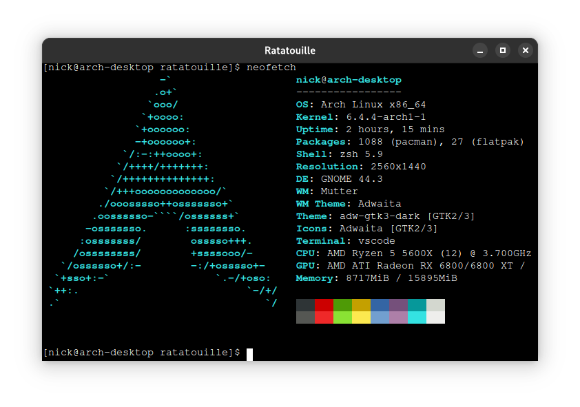

# Ratatouille
Toy terminal-emulator based on [webview](https://github.com/webview/webview), [xterm.js](https://github.com/xtermjs/xterm.js/) and [creack/pty](https://github.com/creack/pty).



# Setup
## Dependencies
- pnpm (a fast, disk space efficient package manager for Node)
- go 1.19

## Build frontend
```bash
cd frontend
pnpm install
pnpm build
```

## Start app
```bash
go run main.go
```
